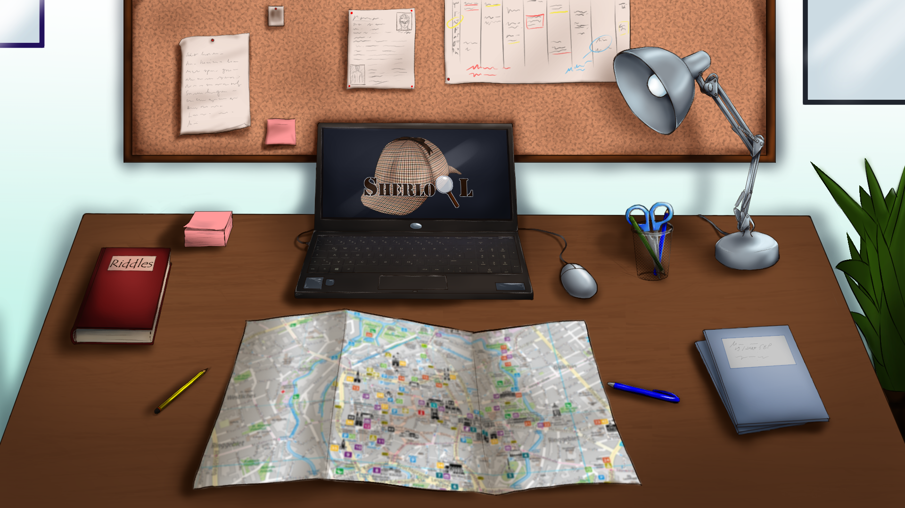

# Teamprojekt: SherloQL

Bei diesem Softwareprojekt handelt es sich um das Teamprojekt *SherloQL*, bestehend aus einer Android-Applikation und einem Editor. Gestartet hat das Projekt im Software Entwicklungs Praktikum (SEP) 2020 mit ursprünglich 11 [Teilnehmern](README.md#das-team) und hat den ersten Platz am Tag der Jungen Software Entwickler, kurz TDSE, belegt. Im Teamprojekt wurde anschließend mit dem Ziel weiterentwickelt, die bereits im SEP erstellte Applikation und den zugehörigen Editor zu verbessern. Von den ursprünglich 11 Personen haben daran noch 7 teilgenommen.

## Android App

Die Android-App SherloQL ist ein Spiel, in dem die Nutzer zum einen die Stadt Braunschweig und, wenn dies gewünscht ist, auch SQL näher kennenlernen können. Umgesetzt wird dies mittels Aufgaben, die quer durch die Stadt verteilt sind und mittels SQL-Anfragen oder Rätseln gelöst werden können.

Wird die App gestartet, so befindet man sich auf dem Homescreen, dem virtuellen Schreibtisch des Nutzers. Über diesen kann man in alle Bereiche der App navigieren. 
Mit einem Klick auf den *aufgefalteten Stadtplan* öffnet sich die OpenStreetMap Karte, in der mittels des Standortes direkt auf den Spieler zentriert und gezoomt wird. Um diese Funktionalität zu realisieren, wird auf die OpenStreetView [API OSMDroid] (https://github.com/osmdroid/osmdroid) zugegriffen. Zu Beginn wird dem Spieler ein erster Zielpunkt auf der Karte angezeigt. Dabei handelt es sich um das erste Rätsel. Um dieses zu starten, muss sich der Spieler innerhalb eines Radius von 50 m von diesem Punkt befinden. Löst er das erste Rätsel, wird ein weiteres freigeschaltet. Das Spiel basiert auf einer dynamischen Story, die sich durch die Handlungen des Spielers verändert. 
Von dem Homescreen ebenfalls erreichbar, über einen Klick auf den *Laptop*, ist die Datenbank. Hier ist es möglich, SQL Anfragen mittels Drop-Down Menüs zu realisieren, um Rätsel für die Story zu lösen oder sich mit den Inhalten vertraut zu machen. 
Neben der Story existiert ebenfalls der Bereich *Rätselsammlung*, in dem der Spieler in diversen Kategorien Rätsel lösen kann. Mit jedem gelösten Rätsel erhält der Spieler Punkte, die in der Story gegen Tipps eingelöst werden können. Die Rätselsammlung ist über das Buch mit dem Titel "Riddles" links von dem Laptop erreichbar.
Oberhalb des Laptops befindet sich die Pinnwand. Diese ist eine Liste aller Artefakte, die während der Story gesammelt werden und enthalten Hinweise, die nützlich für den Story-Fortschritt sind.

Die Android App wurde mit Hilfe der IDE Android Studio Version [Arctic Fox](https://developer.android.com/studio/releases/#arctic-fox) entwickelt. Getestet wurde sie mit unterschiedlichen Android Smartphones, alle mit einer Android Version 9 oder aktueller. 

## Editor

Der Editor wurde als Nebenprojekt entwickelt, um sowohl die Story als auch die Rätsel der Rätselsammlung einfacher zu erstellen beziehungsweise zu bearbeiten. Dazu dient eine übersichtliche Oberfläche, die mittels des Frameworks JavaFX realisiert wird. Für den Umgang mit den jeweiligen JSON-Dateien wird auf eine externe Library zurückgegriffen. 

Der Editor ist in zwei Oberflächen unterteilt, zwischen denen mittels Tabs gewechselt werden kann. Über die jeweiligen Oberflächen ist es möglich, bereits vorhandene JSON-Dateien zu importieren, um Elemente zu bearbeiten oder zu löschen. Es ist ebenfalls möglich, weitere Elemente zu erstellen und diese an das Ende der JSON-Datei anzufügen, um zum Beispiel die Story erweitern oder weitere Rätsel hinzuzufügen. Nach der erfolgreichen Bearbeitung kann der Inhalt wiederum exportiert werden, um diesen in der App zu nutzen.

Folgende Elemente werden für einen erfolgreichen Build-Prozess benötigt:

- [Java Development Kit 8](https://www.oracle.com/java/technologies/javase/javase-jdk8-downloads.html)
- [JavaFX Version 11+](https://gluonhq.com/products/javafx/)
- [JSON-Library](https://github.com/stleary/JSON-java)

## Links

Die App als Download: **[SherloQL-App](https://1drv.ms/u/s!ArDgbq3ak3Zuh6gJRgSm39KFvk8nJw?e=zrtOpM)**

Das Video zum TDSE: **[Video SEP](https://youtu.be/9c2o2cw2Zjs)**

## Das Team

- Christian Weidemann
- Erkan Dadevski
- Kiki Thang
- Matthias Thang
- Matthias Franz
- Pascal Sackhoff
- Samreen Shaikh

im SEP ebenfalls teilgenommen haben
- Judy Al Chaar
- Andrei Chiper 
- Allan Monedero
- Adam Njikam

und unsere Betreuer
- Leandra Fichtel
- Hermann Kroll
- Florian Plötzky

## Poster

